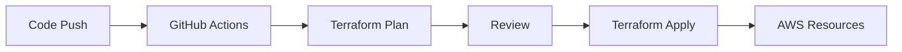
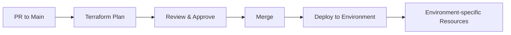

# AWS Terraform Infrastructure Lab 🚀

[](https://terraform.io)
[](https://aws.amazon.com)
[](https://github.com/features/actions)

A comprehensive collection of Terraform-based AWS DevOps projects designed for hands-on learning and practical implementation. Each project demonstrates different AWS services integration with Terraform automation and CI/CD pipelines.

## 📋 Repository Overview

This repository contains multiple independent projects, each focusing on specific AWS services and DevOps practices. Projects are organized in separate branches to maintain clean separation of concerns and enable focused learning.

### 🎯 Learning Objectives

- **Infrastructure as Code (IaC)** with Terraform
- **CI/CD Pipeline** implementation with GitHub Actions
- **AWS Services** integration and management
- **Secret Management** best practices
- **Environment-based deployments**
- **Automated testing and validation**

## 🏗️ Projects Structure

| Project | Branch | Description | AWS Services | Key Features |
|---------|--------|-------------|--------------|-------------|
| **ECR Pipeline** | `ecr-terraform-pipeline` | Container registry with automated CI/CD | ECR, IAM | Terraform automation, Docker builds |
| **Lambda Secrets** | `lambda-secrets-manager` | Serverless function with secrets management | Lambda, Secrets Manager, IAM | GitHub Secrets integration |
| **Lambda Multi-Env** | `lambda-multi-environment` | Multi-environment Lambda deployment | Lambda, Secrets Manager | Environment-specific deployments |
| **EC2 Security** | `ec2-security-groups` | EC2 instances with security configurations | EC2, VPC, Security Groups | PR-triggered deployments |

## 🚀 Quick Start

### Prerequisites

Before starting with any project, ensure you have:

#### Required Tools
```bash
# Terraform
curl -fsSL https://apt.releases.hashicorp.com/gpg | sudo apt-key add -
sudo apt-add-repository "deb [arch=amd64] https://apt.releases.hashicorp.com $(lsb_release -cs) main"
sudo apt-get update && sudo apt-get install terraform

# AWS CLI
curl "https://awscli.amazonaws.com/awscli-exe-linux-x86_64.zip" -o "awscliv2.zip"
unzip awscliv2.zip
sudo ./aws/install

# Git
sudo apt-get install git
```

#### AWS Account Setup
1. Create an AWS account if you don't have one
2. Create an IAM user with programmatic access
3. Attach necessary policies (specific to each project)
4. Configure AWS CLI:
```bash
aws configure
# Enter your Access Key ID, Secret Access Key, and default region
```

#### GitHub Repository Setup
1. Fork this repository
2. Clone your fork locally:
```bash
git clone https://github.com/YOUR_USERNAME/aws_terraform_infra.git
cd aws_terraform_infra
```

### 🔧 General Configuration

#### Environment Variables
Create a `.env` file (never commit this):
```bash
# AWS Configuration
AWS_ACCESS_KEY_ID=your_access_key
AWS_SECRET_ACCESS_KEY=your_secret_key
AWS_DEFAULT_REGION=us-east-1

# Terraform Configuration
TF_VAR_environment=dev
TF_VAR_project_name=your-project-name
```

#### GitHub Secrets
Configure the following secrets in your GitHub repository settings:
- `AWS_ACCESS_KEY_ID`
- `AWS_SECRET_ACCESS_KEY`
- Additional project-specific secrets (detailed in each project README)

## 📁 Project Details

### 1. ECR with Terraform Pipeline
**Branch:** `ecr-terraform-pipeline`

Creates an Amazon Elastic Container Registry with automated CI/CD pipeline that builds and deploys Docker containers.

**Key Features:**
- Automated ECR repository creation
- Docker image building and pushing
- Terraform state management
- Pipeline triggers on code changes

**Quick Start:**
```bash
git checkout ecr-terraform-pipeline
cd ecr-project/
terraform init
terraform plan
terraform apply
```

### 2. Lambda with Secrets Manager
**Branch:** `lambda-secrets-manager`

Deploys AWS Lambda functions with integrated secrets management using AWS Secrets Manager and GitHub Secrets.

**Key Features:**
- Lambda function deployment
- Secrets Manager integration
- GitHub Actions workflow
- Environment variable management

**Quick Start:**
```bash
git checkout lambda-secrets-manager
cd lambda-secrets/
terraform init
terraform plan
terraform apply
```

### 3. Lambda Multi-Environment
**Branch:** `lambda-multi-environment`

Advanced Lambda deployment with multiple environment support (dev, staging, prod) using GitHub Environments.

**Key Features:**
- Multi-environment deployments
- Environment-specific configurations
- Approval workflows
- Environment protection rules

**Quick Start:**
```bash
git checkout lambda-multi-environment
cd lambda-multi-env/
terraform init -backend-config="key=lambda-${ENVIRONMENT}.tfstate"
terraform plan -var-file="${ENVIRONMENT}.tfvars"
terraform apply -var-file="${ENVIRONMENT}.tfvars"
```

### 4. EC2 with Security Groups
**Branch:** `ec2-security-groups`

Creates EC2 instances with properly configured security groups, triggered by pull requests for infrastructure review.

**Key Features:**
- EC2 instance provisioning
- Security group configurations
- PR-triggered Terraform plans
- Infrastructure review workflow

**Quick Start:**
```bash
git checkout ec2-security-groups
cd ec2-project/
terraform init
terraform plan
terraform apply
```

## 🔄 Workflow Patterns

### Standard Deployment Flow


### Environment-based Flow


## 🛡️ Security Best Practices

### Secrets Management
- ✅ Use GitHub Secrets for sensitive data
- ✅ Store secrets in AWS Secrets Manager
- ✅ Never commit secrets to repository
- ✅ Use least privilege IAM policies
- ✅ Rotate secrets regularly

### Infrastructure Security
- ✅ Enable S3 bucket encryption for Terraform state
- ✅ Use VPC and security groups appropriately
- ✅ Enable CloudTrail for auditing
- ✅ Tag all resources consistently
- ✅ Use resource lifecycle management

## 📚 Learning Path

### Beginner Track
1. Start with **ECR Pipeline** project
2. Learn Terraform basics and AWS ECR
3. Understand GitHub Actions workflows
4. Practice with container builds

### Intermediate Track
1. Proceed to **Lambda Secrets** project
2. Learn serverless computing concepts
3. Understand secrets management
4. Practice with Lambda deployments

### Advanced Track
1. Work on **Lambda Multi-Environment**
2. Master environment-based deployments
3. Learn approval workflows
4. Practice with **EC2 Security Groups**

## 📖 Additional Resources

### Documentation
- [Terraform AWS Provider](https://registry.terraform.io/providers/hashicorp/aws/latest/docs)
- [AWS CLI Documentation](https://docs.aws.amazon.com/cli/)
- [GitHub Actions Documentation](https://docs.github.com/en/actions)

### Best Practices
- [Terraform Best Practices](https://www.terraform-best-practices.com/)
- [AWS Well-Architected Framework](https://aws.amazon.com/architecture/well-architected/)
- [AWS Security Best Practices](https://aws.amazon.com/security/security-learning/)

## 🐛 Troubleshooting

### Common Issues
1. **Terraform State Conflicts**
   - Use remote state backend
   - Enable state locking with DynamoDB
   
2. **AWS Permission Errors**
   - Check IAM policies
   - Verify AWS credentials configuration
   
3. **GitHub Actions Failures**
   - Check repository secrets
   - Verify workflow syntax

### Getting Help
- Check project-specific README files
- Review GitHub Actions logs
- Consult AWS CloudTrail for API errors
- Open an issue for persistent problems

## 📄 License

This project is licensed under the MIT License - see the [LICENSE](LICENSE) file for details.

## 🙏 Acknowledgments

- HashiCorp for Terraform
- AWS for comprehensive cloud services
- GitHub for excellent CI/CD capabilities
- The DevOps community for best practices and inspiration

---

**Happy Learning! 🎉**

For project-specific instructions, navigate to the respective branch and follow the detailed README in each project directory.